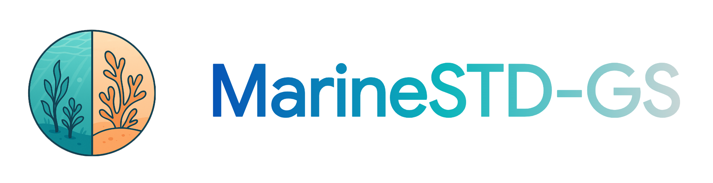
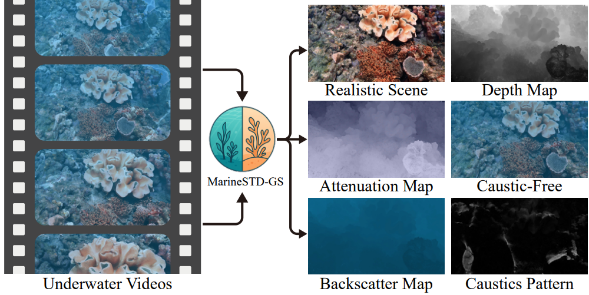

<div align="center">
  

  <h4>Spatiotemporal Degradation-Aware 3D Gaussian Splatting for Realistic Underwater Scene Reconstruction</h4>

  <p>
    
    
    
  </p>
</div>


<p align="center">
  
</p>

<p align="center">
  <em>Input underwater video, disentangled scene and water effects, and controllable underwater rendering outputs.</em>
</p>

This repository provides the public training and rendering implementation of MarineSTD-GS, with the core method and workflow preserved and the codebase cleaned up for release.

## 📖 Abstract

Reconstructing realistic underwater scenes from underwater video remains a meaningful yet challenging task in the multimedia domain. The inherent spatiotemporal degradations in underwater imaging, including caustics, flickering, attenuation, and backscattering, frequently result in inaccurate geometry and appearance in existing 3D reconstruction methods. While a few recent works have explored underwater degradation-aware reconstruction, they often address either spatial or temporal degradation alone, falling short in more realistic underwater scenarios where both types of degradation occur.

We propose MarineSTD-GS, a 3D Gaussian Splatting-based framework that explicitly models both temporal and spatial degradations for realistic underwater scene reconstruction. Specifically, we introduce two paired Gaussian primitives: Intrinsic Gaussians represent the true scene, while Degraded Gaussians render the degraded observations. The color of each Degraded Gaussian is physically derived from its paired Intrinsic Gaussian through a Spatiotemporal Degradation Modeling (SDM) module, enabling self-supervised disentanglement of realistic appearance from degraded underwater imagery. To ensure stable training and accurate geometry, we further introduce a Depth-Guided Geometry Loss and a Multi-Stage Optimization strategy. Experiments on both simulated and real-world datasets show that MarineSTD-GS robustly handles spatiotemporal degradations and outperforms existing methods in novel view synthesis with realistic, water-free scene appearances.

## 🧩 Requirements

This project is developed with the following core dependencies:

- Python >= 3.8
- `nerfstudio==1.1.5`
- `numpy<2`
- `setuptools==69.5.1`

## ⚙️ Installation

The current public release of MarineSTD-GS is developed and tested on **Linux** with the **Nerfstudio 1.1.5** ecosystem.

### 1. Create a conda environment

Nerfstudio requires **Python >= 3.8** and officially recommends using **conda** to manage dependencies. We use a dedicated environment for MarineSTD-GS:

```bash
conda create --name marinestd-gs -y python=3.8
conda activate marinestd-gs
python -m pip install --upgrade pip
```

### 2. Install the core dependencies

For PyTorch, CUDA, tiny-cuda-nn, and Nerfstudio, please refer to the [official
Nerfstudio installation guide](https://docs.nerf.studio/quickstart/installation.html)

One working setup for the current public release is:

```bash
pip uninstall -y torch torchvision functorch tinycudann
pip install torch==2.1.2+cu118 torchvision==0.16.2+cu118 --extra-index-url https://download.pytorch.org/whl/cu118
conda install -c "nvidia/label/cuda-11.8.0" cuda-toolkit
pip install setuptools==69.5.1 packaging
pip install ninja git+https://github.com/NVlabs/tiny-cuda-nn/#subdirectory=bindings/torch
pip install nerfstudio==1.1.5
ns-install-cli
```

### 3. Replace the automatically installed gsplat

Nerfstudio may automatically install an upstream version of `gsplat`. Replace
it with the modified local version provided in:

```text
third_party/gsplat
```

> **Important:** MarineSTD-GS does **not** directly use the upstream
> pip-installed `gsplat` package.

We recommend uninstalling the upstream version first, and then installing the modified local version:

```bash
pip uninstall -y gsplat
cd third_party/gsplat
pip install -e .
cd ../../
```

### 4. Install MarineSTD-GS

Finally, install MarineSTD-GS itself from the repository root:

```bash
pip install -e .
```

## 🗂️ Dataset Preparation

MarineSTD-GS follows a COLMAP / Nerfstudio-style dataset organization.

A typical scene directory used by the current public release is:

```text
<DATA_ROOT>/
├── images_wb/
├── depthAnythingV2_u16/
└── sparse/
    └── 0/
```

In [run_marinestd_batch.sh](./run_marinestd_batch.sh), each entry in
`scene_list` is interpreted as a relative path under `data/`.

### 1. Notes on depth input

- The current public release assumes that depth supervision is provided.
- The expected depth map format is **16-bit grayscale**.
- The expected depth semantics are **relative disparity-like depth**: near large, far small.
- The default example scripts use `depthAnythingV2_u16/`, but other mono-depth sources can also be used if they follow the same convention.
- Depth filenames are expected to match the corresponding filenames in `images_wb/`.

### 2. Notes on train/test split

By default, MarineSTD-GS keeps the standard train/eval split behavior from the
Nerfstudio data pipeline.

If you explicitly add:

```bash
--pipeline.datamanager.dataparser.eval-mode all
```

then all images are used jointly for scene reconstruction, and the standard
train/test separation is no longer preserved.

## 🚀 Training

We recommend using the provided batch script for training and ordinary
post-training rendering:

```bash
bash run_marinestd_batch.sh
```

In [run_marinestd_batch.sh](./run_marinestd_batch.sh), you typically only need
to edit:

- `scene_list`: the scenes you want to run
- `EXP_TAG`: the experiment tag used in output paths
- `MODEL_CONFIG_COMMAND`: additional model-side training options

The script already handles both training and the common dataset-render workflow.
If you want to run only part of the workflow, you can selectively comment out
the corresponding commands in the script.

## 🎬 Rendering

The standard rendering workflow is already integrated into
[run_marinestd_batch.sh](./run_marinestd_batch.sh).

If you want to run rendering manually after training, MarineSTD-GS provides the
custom CLI:

```bash
ns-marinestd-render
```

### 1. Dataset render

The most common usage is dataset-based rendering from a trained config:

```bash
ns-marinestd-render dataset --load-config <CONFIG_YML> --rendered-output-names rgb --output-path <OUTPUT_DIR>
```

Example outputs on the default evaluation split:

```bash
ns-marinestd-render dataset --load-config <CONFIG_YML> --rendered-output-names rgb --output-path <OUTPUT_DIR>
ns-marinestd-render dataset --load-config <CONFIG_YML> --rendered-output-names rgb_spatiotemporal_degraded --output-path <OUTPUT_DIR>
ns-marinestd-render dataset --load-config <CONFIG_YML> --rendered-output-names rgb rgb_spatial_degraded rgb_spatiotemporal_degraded --output-path <OUTPUT_DIR>
```

Example output on the training split:

```bash
ns-marinestd-render dataset --load-config <CONFIG_YML> --split train --rendered-output-names rgb --output-path <OUTPUT_DIR>
```

> In `dataset` mode, multiple `rendered-output-names` are rendered and saved
> into separate output folders. They are **not** concatenated into a single
> comparison image.

### 2. Advanced Applications

In addition to clean novel view synthesis, MarineSTD-GS supports advanced
underwater rendering workflows enabled by the disentanglement between scene
content and water degradation. In the current public release, this includes:

1. re-rendering a scene with water effects using water parameters extracted from the same scene, and
2. transferring water effects across scenes by loading water parameters
   extracted from a different reference scene.

#### Step 1. Export per-image water parameters

```bash
WATER_PARAM_SAVE_DIR="<OUTPUT_DIR>/water_params/"
ns-marinestd-render dataset --load-config <CONFIG_YML> --rendered-output-names rgb_spatial_degraded --output-path <OUTPUT_DIR> --water-param-save-dir "${WATER_PARAM_SAVE_DIR}"
```

This step renders the scene and saves one water-parameter file per image.

#### Step 2. Re-render the same scene with a reference water parameter

```bash
WATER_PARAM_LOAD_PATH="<OUTPUT_DIR>/water_params/0.pt"
NEW_OUTPUT_DIR="<OUTPUT_DIR>/same_scene_water_effects/"
ns-marinestd-render dataset --load-config <CONFIG_YML> --rendered-output-names rgb_spatial_degraded --output-path "${NEW_OUTPUT_DIR}" --disable-td True --water-param-load-path "${WATER_PARAM_LOAD_PATH}"
```

This re-renders the scene with water effects driven by a reference water
parameter from the same scene. At this stage, the TD branch can be disabled
because the current workflow only caches and reuses water parameters.

#### Step 3. Transfer water effects from another scene

Use the same command as above, but replace `--water-param-load-path` with a
water-parameter file exported from another scene and update the output folder
accordingly.

At this stage, the TD branch can also be disabled for the same reason: the
current workflow only caches and reuses water parameters. This enables
cross-scene transfer of underwater effects while keeping the target scene geometry
unchanged.

For a compact summary of the supported rendering modes, please refer to
[render_modes.md](./render_modes.md).

## 📚 Citation

If you find this project useful in your research, please cite our paper:

```bibtex
@inproceedings{10.1145/3746027.3754888,
author = {Liu, Shaohua and Gao, Ning and Gu, Zuoya and Dou, Hongkun and Deng, Yue and Li, Hongjue},
title = {Spatiotemporal Degradation-Aware 3D Gaussian Splatting for Realistic Underwater Scene Reconstruction},
year = {2025},
publisher = {Association for Computing Machinery},
address = {New York, NY, USA},
url = {https://doi.org/10.1145/3746027.3754888},
doi = {10.1145/3746027.3754888},
booktitle = {Proceedings of the 33rd ACM International Conference on Multimedia},
pages = {141--150},
location = {Dublin, Ireland},
series = {MM '25}
}
```

## 🙏 Acknowledgements

We would like to thank the authors and contributors of the following projects:

- [Nerfstudio](https://github.com/nerfstudio-project/nerfstudio)
- [gsplat](https://github.com/nerfstudio-project/gsplat)
- [WaterSplatting](https://github.com/water-splatting/water-splatting)

Their open-source efforts have greatly benefited this project.
